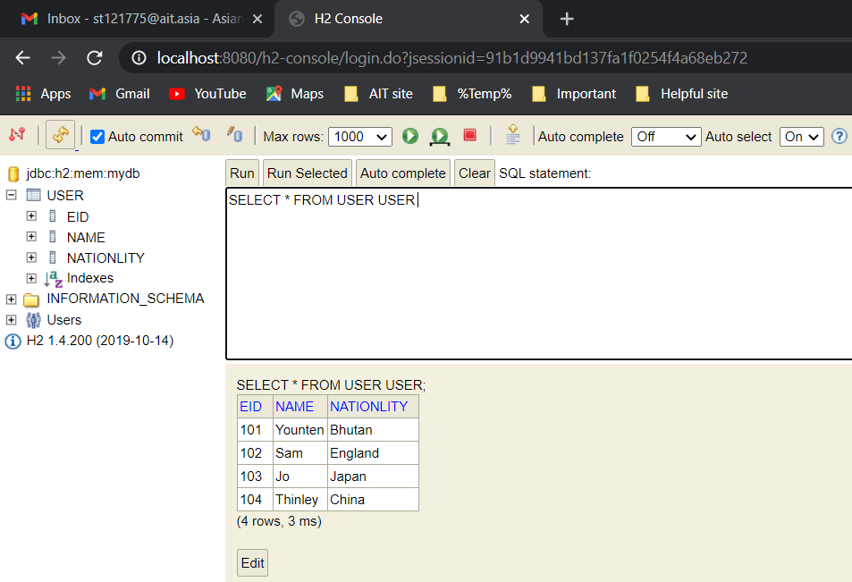
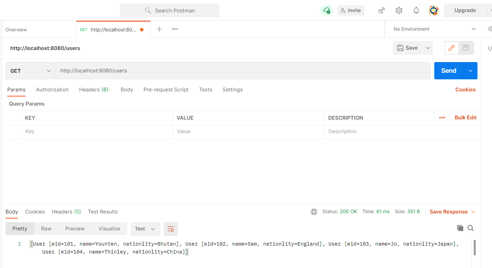
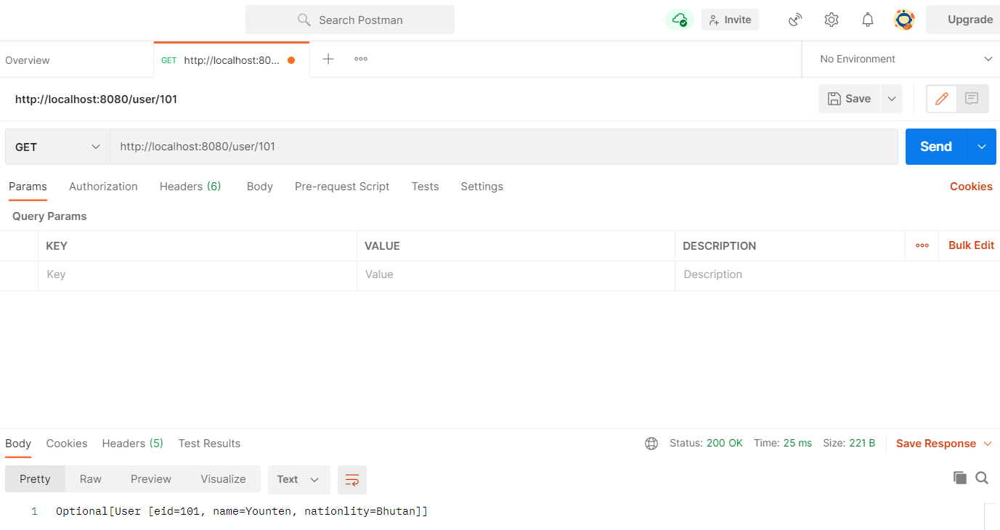
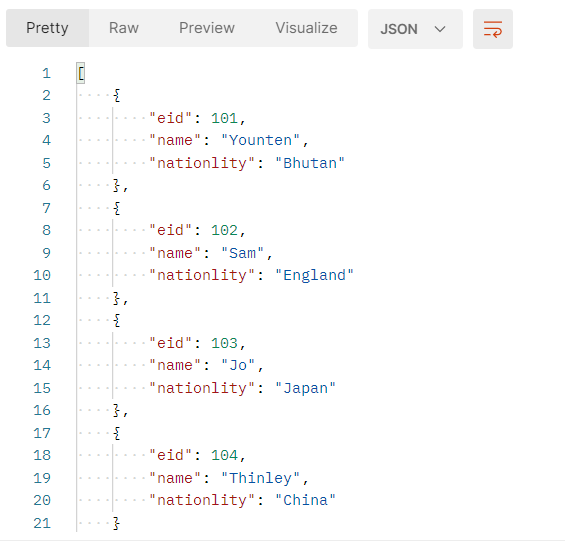
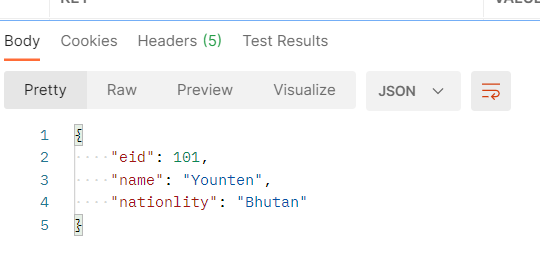
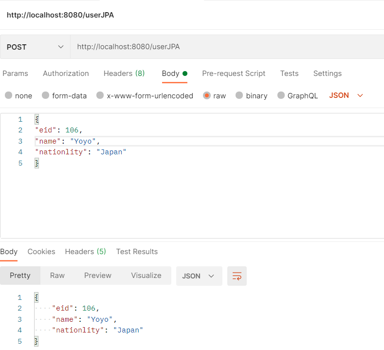
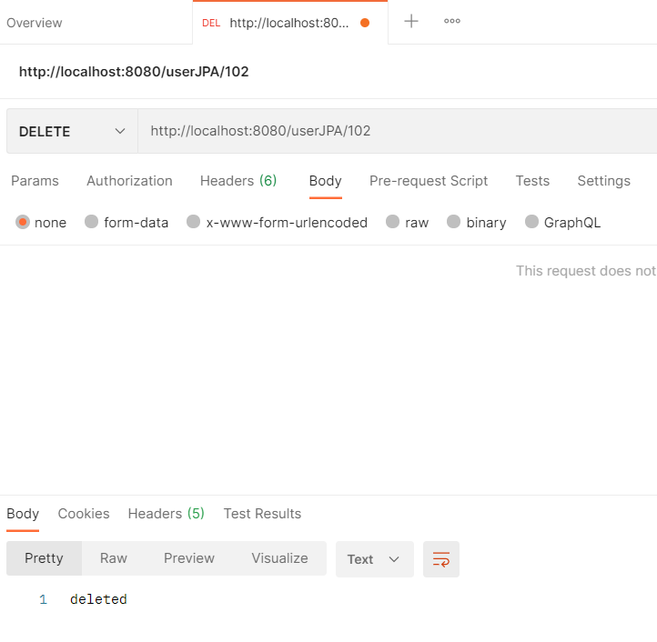

># _Developing MVC+RESTFUL Architecture with Spring Boot_

Spring Boot serves as a high-level tool above Spring and aims to automate the set up of some common dependencies as well as configuration.   For example, Spring Boot embeds a Tomcat server onto their jar files so it does not require the developers to do any web server setup.  The main idea of Spring Boot is to facilitate developers to deliver a production-ready application quickly.

># _Pre-requisites_
* Make sure you have Spring Boot installed.  Follow the guide here → https://spring.io/quickstart 
* Install Postman → https://www.getpostman.com/.  This will be a handy testing tool for testing our RESTful calls.
---
># Step 1: Adding dependencies
For VScode: Generate project from https://start.spring.io/
Create your spring boot starter project, make sure you have imported all the dependencies, i.e., 
1. Web → dependency for making web interfaces.
2. H2 → dependency for generating in-memory database for quick testing.
3. Spring JPA → dependency for supporting many common calls to database without writing a bunch of SQL queries

Go to https://mvnrepository.com and search for tomcat jasper.  
_Choose the version that matches your tomcat-embed-core version inside the Maven dependencies folder.
Copy and paste the dependency on your pom.xml.This dependency allows us to work with .jsp files.  
Similarity, add jackson dataformat xml dependency to your pom.xml file 
(make sure the version matches to your jackson-core inside the **Maven dependencies folder**).  
This dependency allows our RESTful API to work with XML, instead of only json files._

**After this properly format the code (shift + alt +F) and do not forget to save file.**

---

># Step 2: Adding model

>>Inside src/main/java

1. Create a 3 package (name such as com.example.MVC_Rest.model, com.example.MVC_Rest.deo and com.example.MVC_Rest.controller)
2. Inside model package, create a model called User.java with fields of uid, name, and nationality; create setters/getters; and toString

**For Creating Setters/getters and toString:**
Right-Click => source action => generate what we want and select accordinly.

Make sure you mark the class as @Entity so it can work with database, and @Id on top of id to inform the database that it is the primary key

**_Remember Model is basically a code representation of your database table/schemas._**

>> Inside src/main/resources

Create a sql file called data.sql with several insert queries of users.

>> Inside application.properties, put the followings:

spring.h2.console.enabled = true 
spring.datasource.platform = h2
spring.datasource.url = jdbc:h2:mem:mydb

**Note that in the last line of code, you can specify “mydb” to be anything you like but you cannot change “jdbc:h2:mem”**

_The above code will allow the program to access a in-memory database called h2._

Try to launch the app as Spring Boot app, launch your browser, and then go to http://localhost:8080/h2-console 
Put in the specified spring.datasource.url that you have put before and click connect.

_You should have all the users you have inserted specified in the data.sql_

---
># Step 3: Adding views
Inside your src/main, create a folder called webapp
Create two file and use html skill to add user and get user.
A. home.jsp
B. showUser.jsp

># Step 4: Adding controllers
In order to view this view, we need a controller
>Inside  src/main/java

Inside the controller  package, create a class UserController.java
1. Put an annotation of @Controller on top of the public class so Spring Boot knows it is handling requests
2. public String home()
    - Method to access the home.jsp
    - You are required to put @RequestMapping annotation to indicate the routing protocol of this function.  The path attribute specifies the url relative path, while the method attribute specifies the protocol
    - By returning home.jsp, it will automatically searched in the src/main/webapp folder that we have created earlier

---

># Step 5: Adding DAO
Before we can access the database, we need to create the DAO (Data Access Object) interface
>Inside  src/main/java

* Inside the dao package, create a interface UserDao.java
    - Make sure the class extends CrudRepository <User, Integer>

* Inside the same package, create a class UserJPADao.java
    - Make the class extends JpaRepository <User, Integer>

_Inside your UserController.java controller_
Create two dao, one of UserDao type, and another of UserJPADao type.  Both of them should have annotation of @Autowired  (a technique of Dependency Injection that will inject these two variables during runtime)

---

># Step 6: Adding user actions
Create the following methods in _UserController.java controller:_
* public String addUser(User user)
    - Allows creating users using traditional ways, e.g., /addUser?uid=99&name=XX&....
    - Try to add users by going to http://localhost:8080/addUser 
  

* public ModelAndVIew getUser() 
    - Method to read user information using traditional ways, e.g., /getUser?uid=99
    - Try to read users by going to http://localhost:8080/getUser 

---

># Step 8: Adding restful calls

Implementation of some RESTFul APIs and use postman to test
* public String getUsersREST()
    - Restful method to get all users
    - Uses userDao, which will return java object
    - Trick is to add @ResponseBody 
    - Try http://localhost:8080/users

* public String getUserREST() 
    - Restful method to get a single user by id
    - Uses userDao, which will return java object
    - Try http://localhost:8080/user/101
  

* public List<User> getUsersRESTJPA()
    - Above, it returns a java object which may not work well across platforms.  Let’s use JSON/XML .
    - JSON/XML can be returned by using userJPADao
    - To choose to return JSON or XML, try produces = application/xml and produces = application/json inside the @RequestMapping
    - Try http://localhost:8080/usersJPA

* public Optional<User> getUsersRESTJPA()
  - Instead of returning java object of a single user, we can again use jpaDao to return as JSON or XML
  - Try http://localhost:8080/userJPA/101

* public User postUser()
  - Restful method for creating users
  - Can be implemented by having method = RequestMethod.POST
  - Note that it’s not necessary to return User.  You can also return String.
  - Go to postman, and try posting some information
  - You can go to your h2 database and see whether the information is being created

* public String saveOrUpdateEmployee()
    - Restful method for saving or updating users
    - Go to postman, and try posting some information
    - Go to postman, and try putting some information
    - You can go to your h2 database and see whether the information is being updated or not

* public String deleteUser()
  - Restful method for delete
  - Go to postman, and try posting some information
  - You can go to your h2 database and see whether the information is being delete or not
  

>### For more details, check the commment code.