># Spring Security

A simple web application for login/logout/register using Spring Security.
># Adding dependencies

1. Create your spring boot starter project with the following dependencies:

- Lombok - for reducing boilerplate code
- Java Mail Sender - simple api for sending email
- JPA - our lovely Object Relational Mapping (ORM) mapping tool
- H2 - in-memory database (feel free to use others)
- Spring Security - provides built-in authentication/authorization
- Spring Web - provides controllers and MVC support
- Rest Repositories - provides automatic restful controllers
- Validation - provides table validation such as @Email

2. Aside from these dependencies, make sure you install these additional dependencies from maven repositories:

- Tomcat jasper - for working with jsp file
- Jackson xml - in case you would like to work with xml file
- JSTL - a jsp tagging library for looping, conditional logic

For security, you can use fake stmp testing server by creating an account in mailtrap (https://mailtrap.io/)

Then, get the information from settings to use in application.properties.

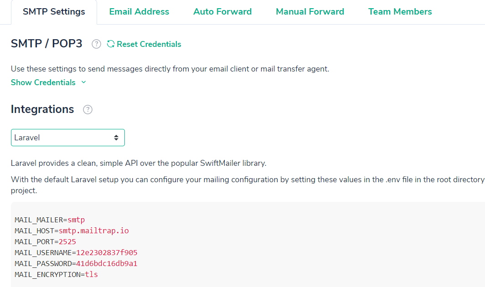

># application.properties

Next, set up the application.properties for your datasource, and smtp properties

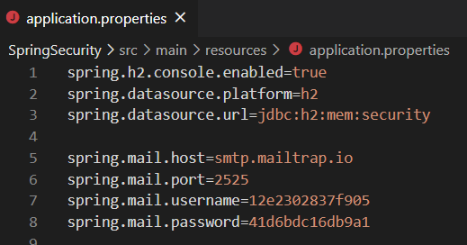

># Adding models
>## Inside src/main/java

Create our package or domain model with User.java and Role.java which have a many-to-many relationship.
In such a case, if we use @ManyToMany, JPA will automatically create an intermediate table in between.

1. User.java
- @Id specifies what is primary key
- For @Getters and @Setters - lombok automatically handles for us
- @GeneratedValue tells JPA that it is auto-increment
- @NotBlank - informs the validation rule.  “message” is the error message that will be displayed in the view
- @Transient - tells JPA not to create this field in the table, but only for internal logic purpose
- @Email comes from validation dependency, validating email
- @ManyToMany will create an intermediate table. FetchType.EAGER specifies that when users are created, it will also fetch the roles,  The opposite is FetchType.LAZY.
If we use Spring Security, we have to use FetchType.EAGER.  
- @JsonBackReference specifies the child of the bidirectional relationship.  Without specifying this, there will be “Infinite Recursion Error”.
- Set is more efficient for handling many to many association, but otherwise, use List

2. Role.java
- mappedBy = “roles” - The word “roles” refer to the object in the User.java.
mappedby tells JPA that it is already mapped, otherwise, you will get duplicate tables.  Another is whether to put on which side of the bidirectional relationship is not important as it only affects the naming of the table, but we usually put on the non-owning (child) side, here is the role side.
- @Data - helper from lombok, giving us a lot of boiler codes such as getters, setters, toString, etc.
- A trivial, if you don’t like the name that JPA gives you for the middle table, you can use @JoinTable to specify the exact name you like, as well as the column name.

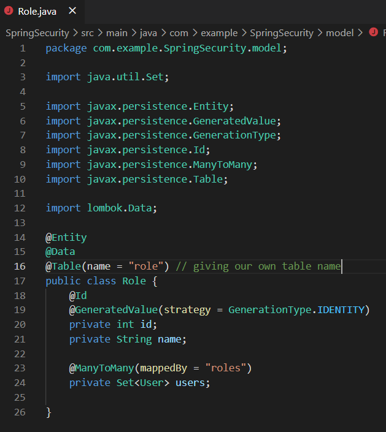

After this, we can run the project and see that default login page will appear but h2 will not work.

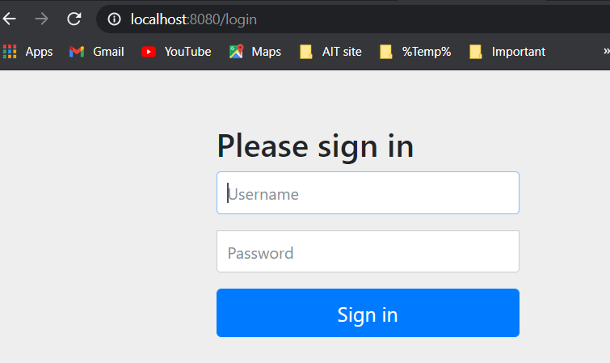

Before we can actually see what kind of tables that Spring creates for us, we need to set our dao and security, since now h2-console will be blocked by Spring security, so we need to write some exceptions, and that security requires dao.  So let’s add dao, then security.
># Adding daos

>## Inside src/main/java

1. Create our JPA repository (DAO) for accessing info with the database.  Since we have two classes, we will have two JPADao classes.

UserJPADao.java - note the use of RepositoryRestResource

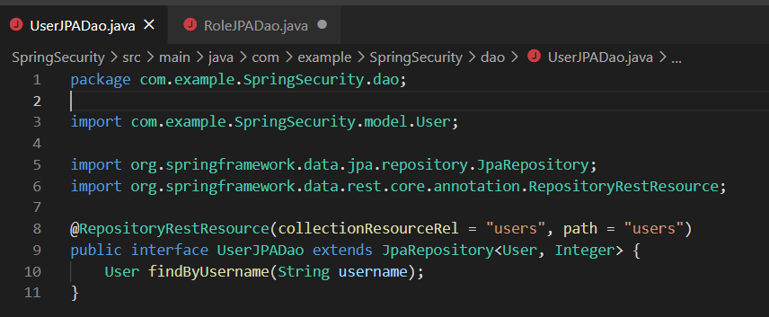

RoleJPADao.java

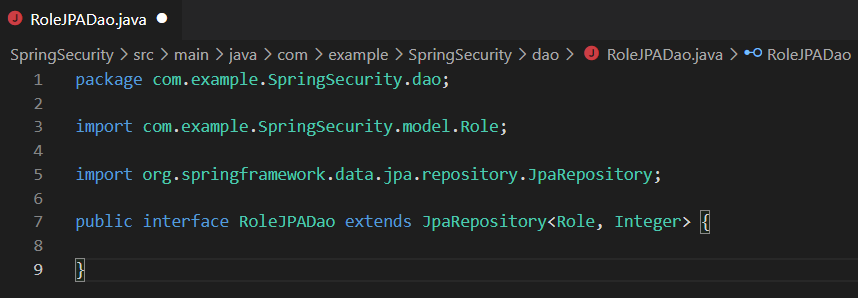

2. Let’s populate our database with few roles using data.sql
id is not needed since its auto generated
Role prefix is important or needed

># Spring Security
>## Inside src/main/java

Create our user login system using Spring Security. There are several files we need to create but once you make some sense, it is easy.
We will create three class: SecurityConfig, MyUserDetailsService and UserDetailsImpl.

Note:
Authentication meaning login and logout.
Authorization meaning who can access which part.

1. SecurityConfig.java extends WebSecurityConfigurerAdapter - this is our main file controlling authentication and authorization logic, as well as general configuration including password encoders

- Note we use BCryptPasswordEncoder().  By adding @Bean, it allows other classes to use it as @Autowired.  The difference between @Bean and @Component is that @Bean is method level while @Component is class level.
- MyUserDetailsService is a UserDetailsService interface implementation which provides service access to user details
- Notice that the access control is also implemented here, which the code is quite self-explanatory.
  
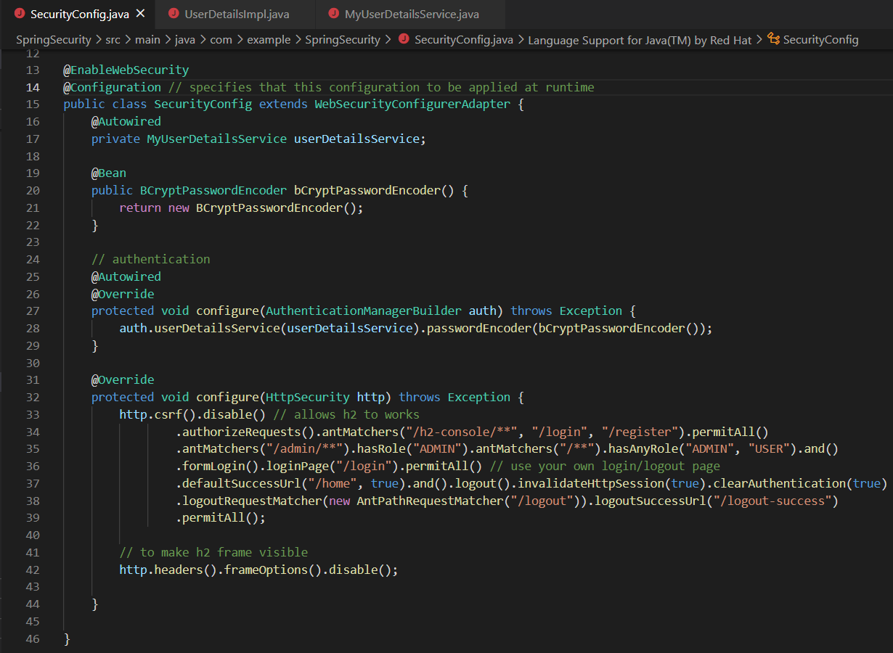

1. MyUserDetailsService.java - this provides a simple api for loading users

- Note that this is simply a @Service.  The main implementation is done in UserDetailsImpl.java which implements UserDetails
- For those who are curious what @Service is for, @Repository, @Service, @Controller are all synonyms. They are all just specializations of @Component annotation. So, generally, they can be used one instead of the other.  HOWEVER, it is also possible that @Repository, @Service, and @Controller may carry additional semantics in future releases of the Spring Framework. Thus, if you are choosing between using @Component or @Service for your service layer, @Service is clearly the better choice

3. UserDetailsImpl.java - this contains concrete implementation of how the users will be created with authorities and will feed the user back to MyUserDetailsService.java

Implement all the Override by using alt+shift+enter.

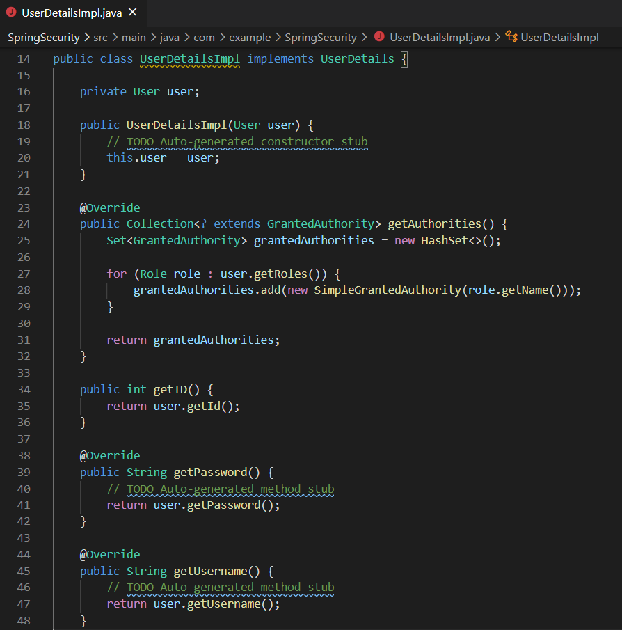

Generally, the app will talk to SecurityConfig.java, which talk to MyUserDetailsService.java to find the users  (also perform null check), and construct the concrete users logic in UserDetailsImpl which embed user with authorities and other attributes. 

At this point, you should be able to launch the app, and go to h2-console, and see how the table looks.  Also you will find that any URL will be directed to /login page.  Also attempt to remove “mappedBy” and relaunch the app, and see how the table looks so you can understand what “duplicate” tables mean.
  
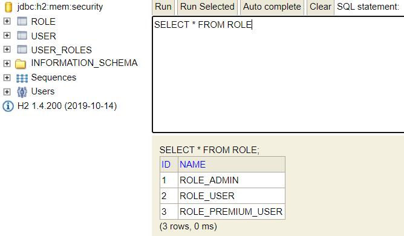

># Adding UserService

Before we actually create the login/logout/register page, let’s make some helper service so we can easily save users.
>## Inside src/main/java

Create package called service.
Add User Service: 
A.	UserService.java
B.	UserServiceImpl.java
Add Email Service:
A.	EmailService.java
B.	EmailServiceImpl.java

1.	UserService.java - simply an interface defining user services

2.	UserServiceImpl.java - a service helper to give us utility function related to users

- Notice that we have @EmailService that notify users of successful registration.  We shall add this shortly.
- Also note that before we save, we encode our password using our autowired bcrypt password encoder.

># Adding EmailService

1.	Doing email service is straightforward in Spring. Let’s first make the interface EmailService.java

2.	Here is the concrete implementation - EmailServiceImpl.java

- ${spring} variable ties to application.properties

># Adding custom validations and error messages
>##  Inside src/main/java 

Create package called validation and add one class.

1.	UserValidator.java - while we have implemented @NotBlank in the User.java, sometimes we want more customized validations.  This can be done by implementing Validator.

- Code is mostly self-explanatory.  Note “size.user.username”, “duplicate.user.username”, etc - these specify the message identifier which will be tied to a file specifying the error messages.

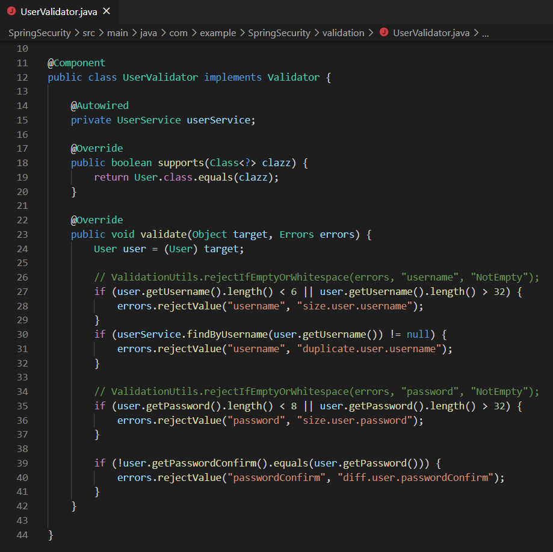

2.	To support custom error messages that are specified in the Validator, we first need to tell Spring Boot where we're going to specify our error messages.

Here we shall create package (inside src/main/java) and create a configuration file CustomMessageSourceConfiguration.java that specify “messages” as the file holding error messages, which refers to messages.properties.

- @Configuration - make sure this file will be run as configuration at runtime

3.	Create messages.properties inside resources

># Adding controller
>## Inside src/main/java 

Create a package called controller.

1.	Now, we are ready to launch some pages.  Let’s create our home controllers UserController.java

- Principal class can retrieve who is the one currently logged in
- @Valid will tell Spring boot to apply validator to the attribute
- Model model as argument provides extra model information to the view.  Very similar to ModelAndView
- @ModelAttribute specifies that certain attribute belongs to a model
- BindingResult is the object holding the errors after validations

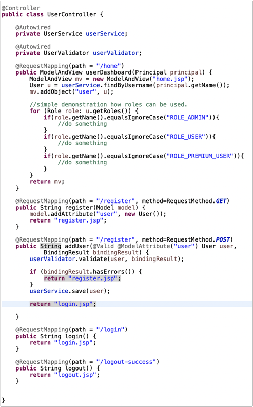
># Adding views

Adding views are quite straightforward.  Here we shall use jsp tagging.  Most codes are quite self-explanatory.  Make sure to put these jsp files under src/main/webapp

1. login.jsp

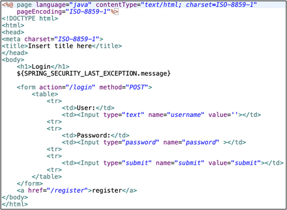

2. logout.jsp

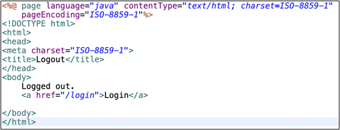

3. register.jsp

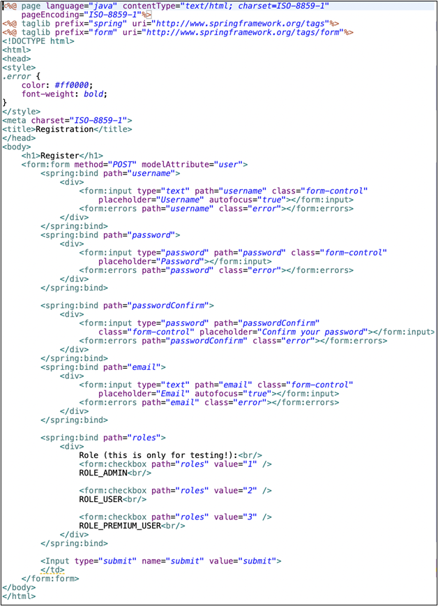

4. home.jsp  - we keep this simple and simply showing the roles.  It is now within your own imagination how you want these roles to be used for displaying different things

- Notice we use jstl for looping

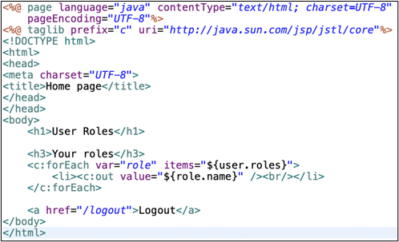

># Here is the overview of the work:

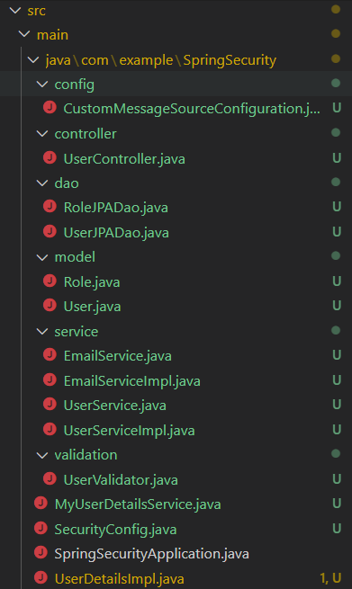
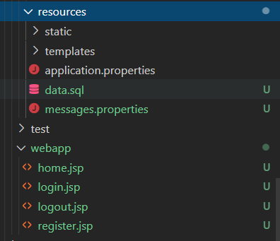

># Output of Spring Security:

>### After running your project, we will see login form where we can login if we have registered.

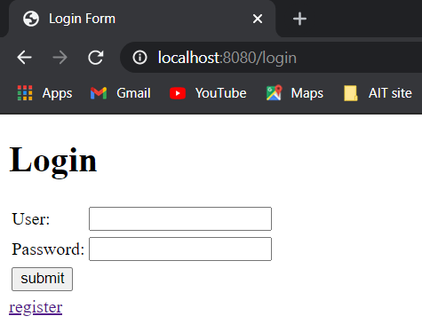

>### Register form let us to register in system and then data will be save in H2.

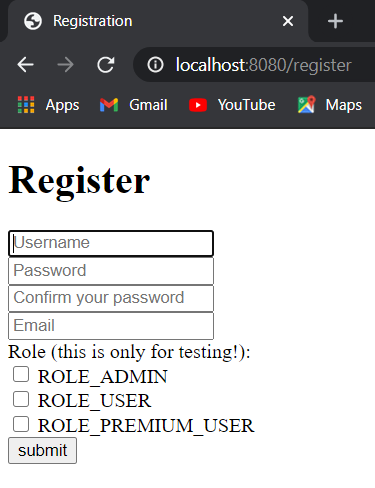

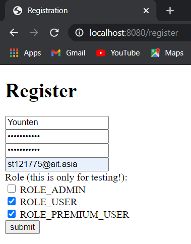

>### After giving the required information and submitting will let us direct login page.

>### Following are some ways to test your successful registration.

1. From terminal:

2. From H2 console:

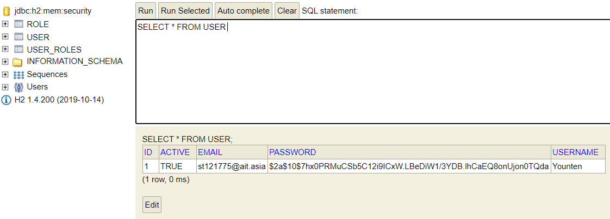

3. From mailtrap:

>### If we can successful register and login then we will be able to see the "home page"

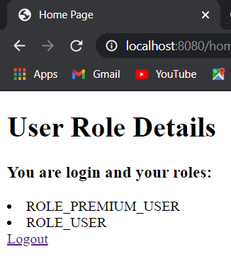

>### Some error messages or handle:

1. From the validation, we see that we cannot register until we fullfill the requirement. Some are requried field with condition.

2.  We can have condition where username should not repeat in database and if there is already register name then we cannot register. Even the email should be valid.

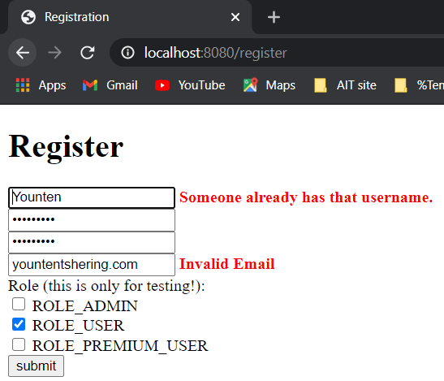

3. When we enter confirm password, it should match with recent entered password.

