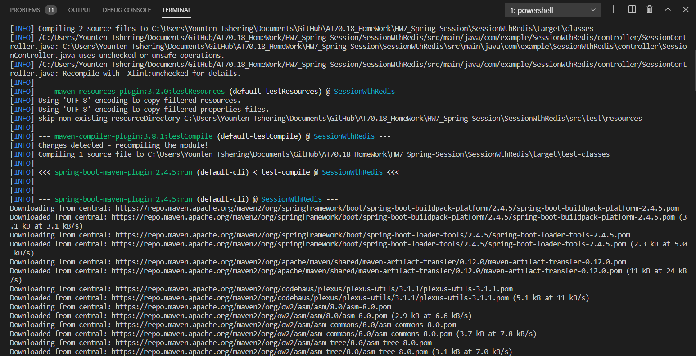

># Session With Redis

Instead of using JDBC as the session store, lack of relational information in session, it is often faster and more effective to use other database frameworks such as Redis which is plain and straightforward. Thus, in this we will connect our application to a Redis and store the session.

># Follow the httpSession for setting up the index and controllor for the spring project.

># Redis as a Session Store

Using Spring Session Redis, follow the following steps:

1. Create a application in repository as "httpSession"

2. Dependencies in pom.xml
Replace the jdbc dependencies with these two dependencies:

1. Change in application.properties

Or we can install Redis docker container.

># Run as a Spring Boot app, and start adding some messages. 

### Should notice the download being started for first run:

Output will be same like before!

https://github.com/Younten-Tshering/Learn_SpringBoot/tree/master/Spring%20Session/httpSession